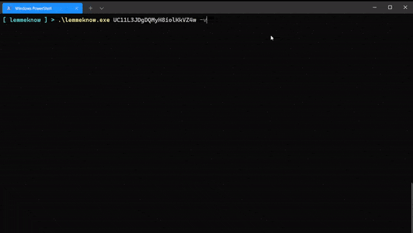
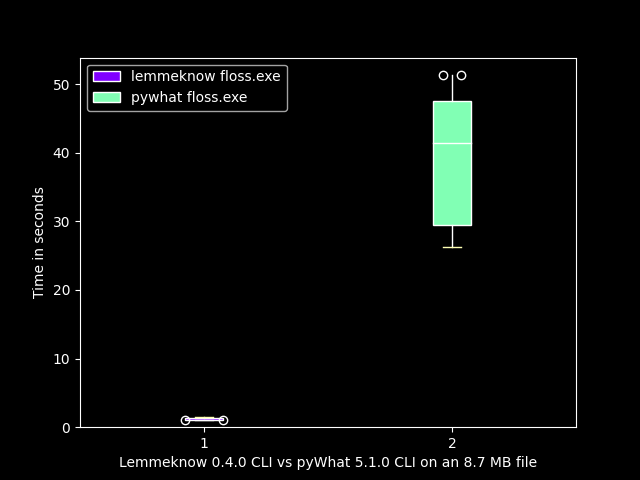
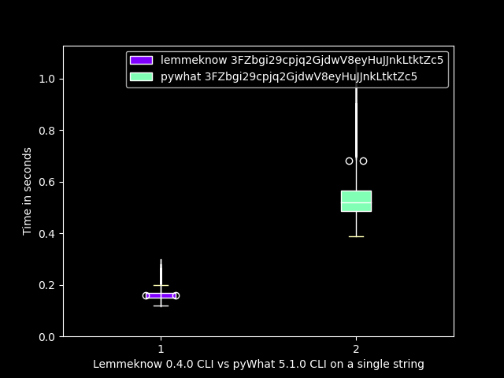

<h1 align="center">
    lemmeknow 
</h1>

<div align="center">
  ⚡ 🦀 🔍
</div>
<div align="center">
  <strong>Just ask `lemmeknow`!</strong>
</div>
<div align="center">
  The fastest way to identify anything
</div>

<br />

<div align="center">
  <!-- Twitter -->
  <a href="https://twitter.com/_swanandx">
    
  </a>
  <!-- GitHub issues -->
  <a href="https://github.com/swanandx/lemmeknow/issues">
    
  </a>
  <!-- GitHub stars -->
  <a href="https://github.com/swanandx/lemmeknow/stargazers">
    
  </a>
  <!-- GitHub forks -->
  <a href="https://github.com/swanandx/lemmeknow/network">
    
  </a>
  <!-- GitHub license -->
  <a href="https://github.com/swanandx/lemmeknow/blob/main/LICENSE">
    
  </a>
</div>

<div align="center">
  <sub>Built with ❤︎ by
  <a href="https://twitter.com/_swanandx">swanandx</a> and
  <a href="https://github.com/swanandx/lemmeknow/graphs/contributors">
    contributors
  </a>
</div>

<br />

<!-- Thnx to choo for above README design <3 https://github.com/choojs/choo/blob/master/README.md -->

`lemmeknow` can be used for identifying mysterious text or to analyze hard-coded strings from captured network packets, malwares, or just about anything.

<br />

## 🧰 Usage 

Pass `TEXT` or `/PATH/TO/FILE` as argument. If you want output in JSON format, then pass `-j / --json` flag.

- `lemmeknow [OPTIONS] <TEXT/FILENAME>`

*e.g.* `lemmeknow UC11L3JDgDQMyH8iolKkVZ4w --json` 


> Run `lemmeknow --help` for all options!

<p align="center">
  
</p>

<br />

## 🔭 Installation
---
### Download executable 📈

 You can directly download executable and run it. No need for any installation.
 > Check releases [here](https://github.com/swanandx/lemmeknow/releases/).

---
### Using `cargo` 🦀

- `cargo install lemmeknow`

---
### Build it from source 🎯

Clone repository

- `git clone https://github.com/swanandx/lemmeknow && cd lemmeknow`

then build and run
- `cargo run`

*e.g.* `cargo run -- <TEXT/FILENAME> [OPTIONS]`

OR

- `cargo build --release`
- `cd target/release/`
- `./lemmeknow`

e.g. `./lemmeknow <TEXT/FILENAME> [OPTIONS]`

---
<br />

## 🚀 API  

Want to use this as a crate in your project? or make a web api for it? No worries! Just add a entry in your `Cargo.toml`

```toml
[dependencies]
lemmeknow = { version = "0.5", default-features = false }

```

OR 

```toml
[dependencies]
lemmeknow = { git = "https://github.com/swanandx/lemmeknow", default-features = false }

```

> Refer to [documentation](https://docs.rs/lemmeknow) for more info.

lemmeknow supports webassembly, that is, it can be compiled for `wasm32-unknown-unknown` target!

<br />

## ⚔️ Benchmarks

lemmeknow is around **33x faster** than pywhat for a file of 8.7MB, and it is **3x faster** for a single string!

| A file of 8.7MB | A single string |
| ---  |  ---   |
| *Summary*: `lemmeknow.exe floss.exe` ran **33.13 ± 9.74** times faster than `pywhat floss.exe` | *Summary*: `lemmeknow.exe 3FZ..Zc5` ran **3.29 ± 0.77** times faster than `pywhat 3FZ..Zc5` |
|      |        |

> Thanks to [SkeletalDemise](https://github.com/SkeletalDemise) for the benchmarks and the whisker plots ✨

<br />

## 🚧 Contributing 

You can contribute by adding new regex, improving current regex, improving code performance or fixing minor bugs! Just open a issue or submit a PR.

<br />

## 💖 Acknowledgement

 This project is inspired by [PyWhat](https://github.com/bee-san/pyWhat)!
 Thanks to developer of it for the awesome idea <3 .
